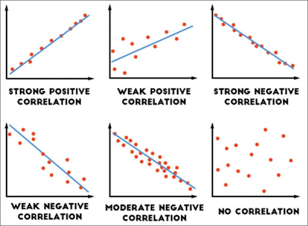

```{r setup, include=FALSE}
knitr::opts_chunk$set(echo = TRUE)
```


In many ways, regression analysis lives at the heart of statistics. It’s a broad term for
a set of methodologies used to predict a response variable (also called a dependent,
criterion, or outcome variable) from one or more predictor variables (also called independent
or explanatory variables).

For example, an exercise physiologist might use regression analysis to develop
an equation for predicting the expected number of calories a person will burn
while exercising on a treadmill. The response variable is the number of calories
burned (calculated from the amount of oxygen consumed), and the predictor variables
might include duration of exercise (minutes), percentage of time spent at
their target heart rate, average speed (mph), age (years), gender, and body mass
index (BMI).


From a theoretical point of view, the analysis will help answer such questions as
these:

* What’s the relationship between exercise duration and calories burned? Is it linear
or curvilinear? For example, does exercise have less impact on the number
of calories burned after a certain point?
* How does effort (the percentage of time at the target heart rate, the average
walking speed) factor in?
* Are these relationships the same for young and old, male and female, heavy
and slim?

From a practical point of view, the analysis will help answer such questions as the
following:

* How many calories can a 30-year-old man with a BMI of 28.7 expect to burn if he
walks for 45 minutes at an average speed of 4 miles per hour and stays within his
target heart rate 80% of the time?
* What’s the minimum number of variables you need to collect in order to accurately
predict the number of calories a person will burn when walking?
* How accurate will your prediction tend to be?

we’ll focus on regression methods that fall under the rubric of **ordinary
least squares (OLS)** regression, including simple linear regression, polynomial regression,
and multiple linear regression.

### OLS Regression

OLS regression fits models of the form:

$$y_i = \beta_0 + \beta_1 x_{i1} + ... + \beta_n x_{in} + \epsilon_i$$

where $i$ is the number of observations and $n$ is the number of predictor variables.
(Although I’ve tried to keep equations out of these discussions, this is one of the few
places where it simplifies things.) In this equation:

* $X_{in}$ is the *nth* predictor value for the *ith* observation.
* $beta_0$ is the intercept
* $\beta_n$ is the regression coefficient for the *nth* predictor

To properly interpret the coefficients of the OLS model, you must satisfy a number of
statistical assumptions:

1. **Normality**—For fixed values of the independent variables, the dependent variableis normally distributed.
2. **Independence**—The Yi values are independent of each other.
3. **Linearity**—The dependent variable is linearly related to the independent variables.
4. **Homoscedasticity**—The variance of the dependent variable doesn’t vary with the levels of the independent 
variables. (I could call this *constant variance*, but saying homoscedasticity makes me feel smarter

### Fitting OLS with `lm()`

In R, the basic function for fitting a linear model is `lm()`. The format is

`myfit <- lm(formula, data)`

where `formula` describes the model to be fit and `data` is the data frame containing the
data to be used in fitting the model. The resulting object (`myfit`, in this case) is a list
that contains extensive information about the fitted model. 

The `formula` is typically written as

`Y ~ X1 + X2 + ... + Xk`

#### Example of Linear Regression

The dataset `women` in the `base` installation provides the height and weight for a set of 15 women
ages 30 to 39. Suppose you want to predict `weight` from `height`.

Having an equation for predicting weight from height can help you to identify overweight or underweight 
individuals:

1. By using **ggplot** produce a graph of `weight` vs `height`
2. By using `lm()` routine, fit a regression equation
3. Is the model following the 4 basic principles?

```{r}
#Plot weight vs heigh using ggplot
require(tidyverse)

ggplot(women, aes(x = height, y = weight)) +
  geom_point() +
  geom_smooth(method = 'lm') +
  labs(title = 'Weight vs Height') +
  theme_bw()

```

```{r echo=TRUE}
#Linear regression with R

fit <- lm(weight ~ height, data = women)
summary(fit)

```

From the output, you see that the prediction equation is:

$$\hat{y_i} = -87.516 + 3.45 x_i$$
In the previous section, you used the `lm()` function to fit an **OLS** regression model
and the `summary()` function to obtain the model parameters and summary statistics.
Unfortunately, nothing in this printout tells you whether the model you’ve fit is appropriate.

Your confidence in inferences about regression parameters depends on the
degree to which you’ve met the statistical assumptions of the OLS model.

Why is this important? Irregularities in the data or misspecifications of the relationships
between the predictors and the response variable can lead you to settle on a
model that’s wildly inaccurate.

**R’s** base installation provides numerous methods for evaluating the statistical assumptions
in a regression analysis. The most common approach is to apply the `plot()` function
to the object returned by the `lm()`

```{r echo=TRUE}
#Plot residual diagnostics for regression model
par(mfrow = c(2, 2))
plot(fit)
```

To understand these graphs, consider the assumptions of OLS regression:

1. **Normality** —If the dependent variable is normally distributed for a fixed set of
predictor values, then the residual values should be normally distributed with a
mean of 0. The Normal Q-Q plot (upper right) is a probability plot of the standardized
residuals against the values that would be expected under normality. If
you’ve met the normality assumption, the points on this graph should fall on
the straight 45-degree line. Because they don’t, you’ve clearly violated the normality
assumption.

2. **Independence**—You can’t tell if the dependent variable values are independent
from these plots. Residual vs Fitted plot shows a parabolic curve. This means a possbile polinomial
relation between `height` and `weight`.

3. **Homoscedasticity**—If you’ve met the constant variance assumption, the points in
the Scale-Location graph (bottom left) should be a random band around a horizontal
line. You seem to meet this assumption.

Finally, the Residuals vs. Leverage graph (bottom right) provides information about
individual observations that you may wish to attend to. The graph identifies outliers,
high-leverage points, and influential observations. Specifically:

4. An **outlier** is an observation that isn’t predicted well by the fitted regression
model (that is, has a large positive or negative residual).

5. An observation with a **high leverage** value has an unusual combination of predictor
values. That is, it’s an outlier in the predictor space. The dependent variable
value isn’t used to calculate an observation’s leverage.

6. An **influential observation** is an observation that has a disproportionate impact on
the determination of the model parameters. Influential observations are identified
using a statistic called **Cook’s distance, or Cook’s D**.


### Polynomial Regression

The residual analysis suggests that you might be able to improve your prediction
using a regression with a quadratic term (that is, $x^2$). You can fit a **quadratic** equation
using the statement

```{r echo=TRUE}

fit2 = lm(weight ~ height + I(height ^ 2), data = women)
summary(fit2)

```

The new term `I(height^2)` requires explanation. `height^2` adds a height-squared
term to the prediction equation. The `I` function treats the contents within the parentheses
as an R regular expression. You need this because the `^` operator has a special
meaning in formulas that is to indicate an **Interaction term**.

The regression ecuation is:

$$\hat{y_i} = 261.87 - 7.34 x_1 ^ 2 + 0.083 x_i ^ 2$$

Let´s review the residual plots to check for the assumptions:

```{r echo=TRUE}
#Residuals plot
par(mfrow = c(2, 2))
plot(fit2)

```

Aswer the following questions:

1. Are the reiduals normaly distributed?
2. Is the variance of residuals constant?
3. Are the residuals independent?
4. Is there any evidence of Outliers or Leverage points?

The `summary` function gives more information:

1. `height` is statistically significant since the $p-val < 0.05$
2. Having a square term `height^2` is significant and improves model addecuacy (according to residual plots)
3. The model goodness of fit is $R_{adj} ^ 2 = 0.99$ (the model fits 99.94% of the data)

In general, an nth-degree polynomial produces a curve with n-1 bends. To fit a cubic
polynomial, you’d use

`fit3 <- lm(weight ~ height + I(height ^ 2) +I(height ^ 3), data = women)`

Another alternative is to use the `poly()` function:

```{r echo=TRUE}

fit3 <- lm(weight ~ poly(height, 3), data = women)
summary(fit3)

```

Is a Polinomial of grade 3 is still linear?


### Multiple Linear Regression

When there’s more than one predictor variable, simple linear regression becomes
**multiple linear regression**, and the analysis grows more involved. Technically, polynomial
regression is a special case of multiple regression.

We’ll use the `state.x77` dataset in the `base` package for this example. Suppose you
want to explore the relationship between a state’s murder rate and other characteristics
of the state, including population, illiteracy rate, average income, and frost levels
(mean number of days below freezing).

A good first step in multiple regression is to examine the relationships among the
variables two at a time. The **bivariate correlations** are provided by the `cor()` function,
and scatter plots are generated from the `scatterplotMatrix()` function in the `car`
package.

```{r echo=TRUE}
library(car)

#First we create the dataframe from the matrix state.x77 becose lm uses a data frame as input
glimpse(state.x77)

states <- as.data.frame(state.x77[,c("Murder", "Population",
"Illiteracy", "Income", "Frost")])
glimpse(states)

#The correlation matrix
cor(states)

#scatter plot
scatterplotMatrix(states, main = "Scatter Plot Matrix")
```




Now let’s fit the multiple regression model with the `lm()`:

```{r}
fit.lm <- lm(Murder ~ Population + Illiteracy + Income + Frost, data = states)
summary(fit.lm)
```

When there’s more than one predictor variable, the regression coefficients indicate
the increase in the dependent variable for **a unit change in a predictor variable, holding
all other predictor variables constant**. For example, the regression coefficient for
`Illiteracy` is $4.14$, suggesting that an increase of 1 in illiteracy is associated with a
4.14% increase in the murder rate, controlling for population, income, and temperature.
The coefficient is significantly different from zero at the $p < .0001$ level.

Let´s review if the assumption holds for the residuals:

```{r}
#residual Plots
par(mfrow = c(2, 2))
plot(fit.lm)
```

Base on the results, the Multiple Linear Model holds the assumptions? Can we improve the acccuracy of the model?


#### Multiple Regression with Interactions

Some of the most interesting research findings are those involving interactions among
predictor variables. Consider the automobile data in the `mtcars` data frame. Let’s say
that you’re interested in the impact of automobile `weight` and `horsepower` on `mileage`.

You could fit a regression model that includes both predictors, along with their
interaction, as shown in the next listing.

$$y_i = \beta_0 + \beta_1 hp_i + \beta_2 wt_i + \beta_{12} hp_i wt_i$$


```{r echo=TRUE}
fit.int <- lm(mpg ~ hp + wt + hp : wt, data = mtcars)
summary(fit.int)
```


You can see from the `Pr(>|t|)` column that the **interaction** between `horsepower` and
car `weight` is **significant**. What does this mean? Here it means the relationship
between miles per gallon and horsepower varies by car weight

You can visualize interactions using the `effect()` function in the `effects` package.

`plot(effect(term, mod, xlevels), multiline=TRUE)`

```{r}
require(effects)
require(vcov)
plot(effect("hp:wt", fit.int, , list(wt = c(2.2, 3.2, 4.2))), multiline = TRUE)

```

When we compare the $R^2$ of the linear model against the linear model with interactions, it is clear that
adding interactions terms improve from $R^2 = 0.8148$ to $R^2 = 0.87$.

```{r}
fit.lm =  lm(mpg ~ hp + wt, data = mtcars)
summary(fit.lm)
```

Is this improvement good enough?

To compute a $\chi^2$ difference test, the difference of the $\chi^2$ values of the two models in question
is taken as well as the difference of the *degrees of freedom*. Frequently, models under
investigation differ from each other by just one more free parameter or one more fixed parameter,
respectively, so in these cases the difference of the degrees of freedom is 1.

$$\chi^2 = \chi^2_s - \chi^2_l$$
$$df = df_s - df_l$$

Here, $s$ denotes the “smaller” model with fewer parameters and therefore more degrees of freedom, whereas $l$ 
denotes the “larger” model with more parameters and therefore fewer degrees of freedom.

```{r echo=TRUE}
#ANOVA test for Linear model vs Model with Interactions
anova(fit.lm, fit.int)

```

After running the test, the $PR(>F) \le 0.05$; so, including the interaction terms improved the model
performance.

### Regression Diagnostics

In the previous section, you used the `lm()` function to fit an **OLS** regression model
and the `summary()` function to obtain the model parameters and summary statistics and the `plot()`function
to get basic remedial diagnostics.

Remember, a good model needs to have some properties on the residuals:

1. Normaly Distributed $\epsilon_i \sim N(0, \sigma^2)$
2. Variance must be constant and uncorrelated
3. Predictor variables mut be **linear Independent** (uncorrelated)

The `car` package provides a number of functions that significantly enhance your ability
to fit and evaluate regression models:


#### Normality

The `qqPlot()` function provides a more accurate method of assessing the normality
assumption than that provided by the `plot()` function in the base package. It plots the
studentized residuals (also called studentized deleted residuals or jackknifed residuals) against
a $t$ distribution with $n – p – 1$ degrees of freedom:

```{r echo=TRUE}
require(car)
#fitting the linear model
fit.int <- lm(mpg ~ hp + wt + hp : wt, data = mtcars)
summary(fit.int)

qqPlot(fit.int, labels = row.names(states), id.method="identify", simulate = TRUE, main = "Q-Q Plot")

```

The qqPlot() function generates the probability plot displayed in. The option `id.method ="identify"` 
makes the plot interactive—after the graph is drawn, When `simulate = TRUE`, a 95% confidence envelope is 
produced using a parametric bootstrap.

Another way to check for normality is by drawing a histogram of the residals:

```{r echo=TRUE}
z = rstudent(fit.int)

hist(z, freq=FALSE, xlab="Studentized Residual", main="Distribution of Errors")

```

#### Independence of Errors

As indicated earlier, the best way to assess whether the dependent variable values (and
thus the residuals) are independent is from your knowledge of how the data were collected.

For example, time series data often display autocorrelation—observations collected closer in time are more 
correlated with each other than with observations distant in time. The car package provides a function for 
the Durbin–Watson test to detect such serially correlated errors.

You can apply the Durbin–Watson test to the multiple-regression problem with the following code

```{r echo=TRUE}
durbinWatsonTest(fit.int)

```

since the `p-value \ge 0.05` there is no evidence of autocorrelation on residuals. Thus, residuals are
independent.

Other way to look at this is by seeing at the **autocorrelation plot** for residuals by using the command
`acf`:

```{r echo=TRUE}
acf(fit.int$residuals)
```

Here we see that residuals are independent.

#### Multicolinearity

We will revis this topic when we talk about **regularization**.

Multicollinearity can be detected using a statistic called the **variance inflation factor (VIF)**. 
For any predictor variable, the square root of the VIF indicates the degree to
which the confidence interval for that variable’s regression parameter is expanded relative
to a model with uncorrelated predictors (hence the name). VIF values are provided
by the `vif()` function in the `car` package. As a general rule, indicates a **multicollinearity** problem

```{r echo=TRUE}
#Variance Inflation Factor
vif(fit.int)
vif(fit.lm)

```

Hence, the model shows a high degree of correlation between `hp` and `wt` drove by the interaction term. When
an interaction term is include in the model, **VIF** tends to have higher values.

#### Outliers

Outliers are observations that aren’t predicted well by the model. They have unusually
large positive or negative. Positive residuals indicate that the model is underestimating the response value, 
whereas negative residuals indicate an overestimation.

In order to detect Outliers, we use **studentized residuals**

```{r}

z = rstudent(fit.int)
plot(z, main = 'Studentized Residuals')

#Running Outlier test
outlierTest(fit.int)

```

#### High-Leverage Points

Observations that have **high leverage** are outliers with regard to the other predictors.

In other words, they have an unusual combination of predictor values. The response
value isn’t involved in determining leverage.

Observations with high leverage are identified through the hat statistic. For a given
dataset, the average hat value is `p/n`, where p is the number of parameters estimated
in the model (including the intercept) and `n` is the sample size.


```{r echo=TRUE}

hat.plot <- function(fit){
  
  p <- length(coefficients(fit))
  n <- length(fitted(fit))
  plot(hatvalues(fit), main = "Index Plot of Hat Values")
  abline(h = c(2, 3)* p / n, col = "red", lty = 2)
  identify(1 : n, hatvalues(fit), names(hatvalues(fit)))
  
}

hat.plot(fit.int)

```

The hat matrix provides a measure of leverage. It is useful for investigating whether one or more observations 
are outlying with regard to their X values, and therefore might be excessively influencing the regression results

$$H = X(X^T X) ^{-1} X^T$$

and determines the fitted values $\hat{Y}$

$$\hat{y} = Hy$$
The diagonal elements of $H$, $h_{ii}$, are called leverages and satisfy

$$0 \le h_{ii} \le 1$$
$$\sum_{i = 1} ^ n h_{ii} = p$$

where $p$ is the number of coefficients, and $n$ is the number of observations

Outliers are sample observations with unusual response values, while sample observations
with unusual predictor values have high leverage. We can consider both concepts together
in a combined measure called Cook's distance.

An observation with a large Cook's distance can be an outlier, a high-leverage observation, or both.

How high would a Cook's distance have to be for us to be concerned? As with most aspects of complex regression
modeling, there are no hard and fast rules but, rather, general guidelines that work well in
most situations. A useful rule of thumb is to consider investigating further if the highest
Cook's distance is greater than 0.5, particularly if it is greater than 1. 

Observations with a Cook's distance less than 0.5 are rarely so influential that they should be removed 
from the main analysis. Those with a Cook's distance between 0.5 and 1 are sufficiently
influential that they should be removed from the main analysis. Those with a Cook's
distance greater than 1 are sufficiently influential that they should be removed from
the main analysis. We should never remove an observation arbitrarily just to get a better-fitting 
model—this could be considered manipulating the analysis to suit our purposes.

One formula for the /th observation's Cook's distance is:

$$D_i = \frac{r_i^2 h_i}{(k + 1)(1 - h_i)}$$
where $r_i$, is the rth observation's standardized residual, $h_i$ is the rth observation's leverage,
and $k$ is the number of predictor terms in the model (excluding the constant intercept term)

#### Influential Observations

Influential observations have a disproportionate impact on the values of the model
parameters. Imagine finding that your model changes dramatically with the removal
of a single observation. It’s this concern that leads you to examine your data for influential
points.

There are two methods for identifying influential observations: **Cook’s distance (or
D statistic)** and **added variable plots**. Roughly speaking, Cook’s D values greater than
$4/(n – k – 1)$, where $n$ is the sample size and $k$ is the number of predictor variables,
indicate influential observations. You can create a Cook’s D plot with the following code:

```{r echo=TRUE}
#Using the mtcar data set
fit.int = fit.lm =  lm(mpg ~ hp + wt, data = mtcars)
#sample size n
n = nrow(mtcars)
#number of predictors
k = length(fit.int$coefficients)

#Influential Observation plot
cutoff <- 4 / (n - k - 2)

plot(fit.int, which = 4, cook.levels = cutoff) +
abline(h=cutoff, lty=2, col="red")

```


You can combine the information from outlier, leverage, and influence plots into
one highly informative plot using the `influencePlot()` function from the `car` package

```{r}
library(car)
influencePlot(fit.int, id.method = "identify", main= " Influence Plot", 
              sub="Circle size is proportional to Cook's distance")
```

### How a full regression analysis looks like

Consider the `diamonds`data set. We are interested in predict `price`  as afunction of `carat` (weight of the
diamond), `cut` (quality), `color`, `clarity`, `x` (lenght), `y` (widht), `z` (depth) and a combined variable
that measures between `x, y and z` called `depth`.

```{r echo=TRUE}
#Visualize the data with corplot
require(corrplot)
require(tidyverse)
col <- colorRampPalette(c("#BB4444", "#EE9988", "#FFFFFF", "#77AADD", "#4477AA"))

diamonds %>%
  dplyr::select(price, carat, depth, table, x, y, z) %>%
  cor() %>%
  corrplot(method="color",  
         type="lower", order="hclust", 
         addCoef.col = "black", # Add coefficient of correlation
         tl.col="black", tl.srt=45, #Text label color and rotation
         # hide correlation coefficient on the principal diagonal
         diag=FALSE)

#Visualize relationship between categorical variables

p1 = ggplot(diamonds, aes(x = cut, y = price, fill = cut)) +
  geom_boxplot() +
  theme(legend.position = 'none')
p2 = ggplot(diamonds, aes(x = color, y = price, fill = color)) +
  geom_boxplot() +
  theme(legend.position = 'none')
p3 = ggplot(diamonds, aes(x = clarity, y = price, fill = clarity)) +
  geom_boxplot() +
  theme(legend.position = 'none')

require(gridExtra)
grid.arrange(p1, p2, p3)

ggplot(diamonds, aes(x = carat, y = price, color = clarity, alpha = 0.8)) +
  geom_point()

#Create the model
model1 = lm(price ~  carat + cut + color + clarity + depth, data = diamonds)
summary(model1)

#Check for multicolinearity
vif(model1)

#Checking assumptions
par(mfrow = c(2, 2))
qqPlot(model1, labels = row.names(states), id.method="identify", 
       simulate = TRUE, main = "Q-Q Plot") #Normality
acf(model1$residuals) #Autocorrelation in residuals

#Compute Studentized residuals
z = rstudent(model1)
plot(z, main = 'Studentized Residuals') +
  abline(h = c(-2.5, 2.5), col = 'red', lty = 2)

#Leverage
#sample size n
n = nrow(diamonds)
#number of predictors
k = length(model1$coefficients)

#Influential Observation plot
cutoff <- 4 / (n - k - 2)

plot(model1, which = 4, cook.levels = cutoff) +
abline(h=cutoff, lty=2, col="red")

```

What are your conclusions onhe analysis?

### Remedial actions for Linear Regression

#### Transforming Variables

When models don’t meet the normality, linearity, or homoscedasticity assumptions,
transforming one or more variables can often improve or correct the situation. Transformations
typically involve replacing a variable $y$ with $y^\lambda$. Common values of $λ$ and
their interpretations are given. If $y$ is a proportion, a logit transformation
$ln(\frac{y}{1-Y})$ is often used.


Let´s see how transformation works. for example, we will applied a $log(y)$ transformation.

```{r echo=TRUE}
ggplot(diamonds, aes(x = log(carat), y = log(price), color = clarity, alpha = 0.8)) +
  geom_point()
```


From the previus analysis, it seems that if we applied a $log(y)$ transformation, the model could be
improved.

```{r echo=TRUE}
#Create the model
temp = diamonds %>%
  filter(x > 0 & y > 0 & z > 0)

model2 = lm(log(price) ~  log(carat) + cut + color + clarity + log(depth) + log(x) +log(y) + log(z), data = temp)
summary(model2)

#Checking assumptions
par(mfrow = c(2, 2))
qqPlot(model2, labels = row.names(states), id.method="identify", 
       simulate = TRUE, main = "Q-Q Plot") #Normality
acf(model2$residuals) #Autocorrelation in residuals

#Compute Studentized residuals
z = rstudent(model2)
plot(z, main = 'Studentized Residuals') +
  abline(h = c(-2.5, 2.5), col = 'red', lty = 2)

#Leverage
#sample size n
n = nrow(diamonds)
#number of predictors
k = length(model2$coefficients)

#Influential Observation plot
cutoff <- 4 / (n - k - 2)

plot(model2, which = 4, cook.levels = cutoff) +
abline(h=cutoff, lty=2, col="red")

```

What changed from `model1` to `model2`?

### Remove Variables

Changing the variables in a model will impact the fit of the model. Sometimes, adding
an important variable will correct many of the problems that we’ve discussed. Deleting
a troublesome variable can do the same thing.

Deleting variables is a particularly important approach for dealing with multicollinearity.
If your only goal is to make predictions, then multicollinearity isn’t a problem.
But if you want to make interpretations about individual predictor variables, then
you must deal with it. 

The most common approach is to delete one of the variables involved in the multicollinearity 
(that is, one of the variables with a $\sqrt{VIF} > 2$. Then, remove variables, one at a time, with
$p_{val} > 0.05$ starting with the highest $p_{val}$

However, one of the mos effective approacehs is to use **Stepwise Regression**.

In stepwise selection, variables are added to or deleted from a model one at a time,
until some stopping criterion is reached. For example, in *forward stepwise* regression,
you add predictor variables to the model one at a time, stopping when the addition of
variables would no longer improve the model. In *backward stepwise* regression, you start
with a model that includes all predictor variables, and then you delete them one at a
time until removing variables would degrade the quality of the model. In *stepwise stepwise*
regression (usually called stepwise to avoid sounding silly), you combine the forward
and backward stepwise approaches. Variables are entered one at a time, but at
each step, the variables in the model are reevaluated, and those that don’t contribute
to the model are deleted. The `step()`function is used for it:

```{r echo=TRUE}
model2 = lm(log(price) ~  carat + cut + color + clarity + log(depth) + log(x) +log(y) + log(z), data = temp)
summary(model2)

#Remove variables with multicolineality
vif(model2)

#Removing x since it has the highest VIF
model2 = lm(log(price) ~  carat + cut + color + clarity + log(depth) +log(y) + log(z), data = temp)
summary(model2)
vif(model2)

#Removing y
model2 = lm(log(price) ~  carat + cut + color + clarity + log(depth) + log(z), data = temp)
summary(model2)
vif(model2)

#using step function
model3 = step(model2)
summary(model3)

```

We will explore more on transformations on **General Linear models** and more on variable selection and
multicolinearity on **Regularization**.

### Exersise on Regression

The `mlbench` package provide several datasets. One  them is the `BostonHousing` that has the price of
hauses in Boston area:


The variable of interest is `cmedvc` wich is the corrected median value o occupied homes. Build a
linnear regression model to predict `cmedv` in Boston area.


```{r}
require(mlbench)
data("BostonHousing")
head(BostonHousing)
str(BostonHousing)
```

```{r}
#Exploratory Data Analysis
#y = medv

#Distribicion del Valor MEdio de casas


hist(BostonHousing$medv)
mean(BostonHousing$medv)
summary(BostonHousing$medv)


#Hipotesis 1
#El Valor de una casa depende de la cercania al Rio. Mientras mas cerca del rio mas caro
require(tidyverse)
ggplot(BostonHousing, aes(x = chas, y = medv, fill = chas)) +
  geom_boxplot()

#Correlacion entre la variables
correlacion = BostonHousing %>%
  select(-chas) %>%
  cor()

col <- colorRampPalette(c("#BB4444", "#EE9988", "#FFFFFF", "#77AADD", "#4477AA"))
require(corrplot)

corrplot(correlacion, method="color", col=col(200),  
         type="upper", order="hclust", 
         addCoef.col = "black", # Add coefficient of correlation
         tl.col="black", tl.srt = 45, #Text label color and rotation
         # hide correlation coefficient on the principal diagonal
         diag=FALSE 
         )

#Analisis de Regresion

#Forma larga
m.lm = lm(medv ~ crim + zn + indus + chas + nox + 
            rm + age + dis + rad + tax + ptratio + b + lstat,
          data = BostonHousing)

m.lm2 = lm(medv ~. , data = BostonHousing)
summary(m.lm)
summary(m.lm2)

#Algoritmo de Seleccion de Variables
m.lm3 = step(m.lm2)
summary(m.lm3)

#El modelo es valido?
#Revisar los supuestos NID(0, sigma2)

plot(m.lm3)

#El modelo Lineal no es adecuado
#Provar con otro modelo: Transformar todas las variables a Log


temp = BostonHousing %>%
  gather(Var.name, Var.Value, 1 : 13) %>%
  filter(Var.name != "chas")

ggplot(temp, aes(x = Var.Value, y = medv, color = Var.name)) +
  geom_point() +
  facet_wrap(~Var.name, scales = 'free') +
  theme_bw() +
  theme(legend.position = 'none') +
  geom_smooth()


m.lm = lm(log(medv) ~ log(crim) + zn + log(indus) + chas + log(nox) + 
            log(rm) + log(age) + log(dis) + log(rad) + log(tax) + log(ptratio) + log(b) + log(lstat),
          data = BostonHousing)
m.lm2 = step(m.lm)
summary(m.lm2)

plot(m.lm2)


#Cual es el papel de la intercepcion
mean(m.lm$residuals)

#Modelo sin Constante
m.sc = lm(log(medv) ~ log(crim) + zn + log(indus) + chas + log(nox) + 
            log(rm) + log(age) + log(dis) + log(rad) + log(tax) + log(ptratio) + log(b) + log(lstat) - 1,
          data = BostonHousing)
mean(m.sc$residuals)


```
