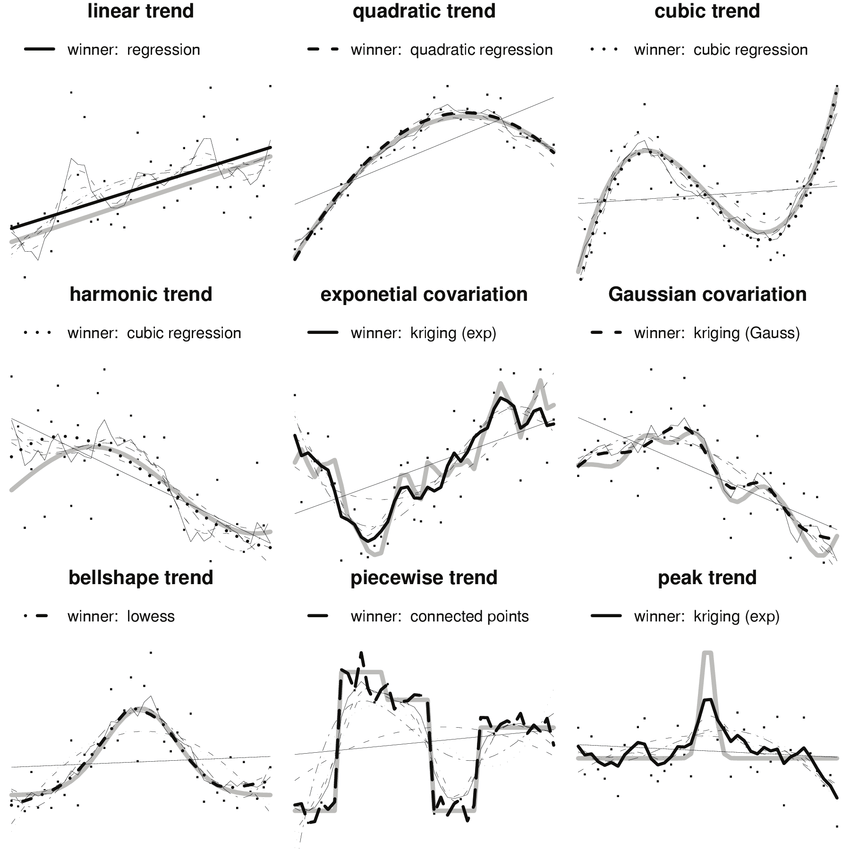
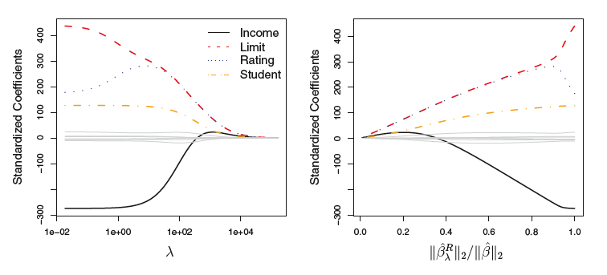

```{r message=FALSE, warning=FALSE}
knitr::opts_chunk$set(echo = TRUE)

#Cargar librerias
require(tidyverse)
require(data.table)
require(tidymodels)
require(visreg)
require(arules)
require(patchwork)

theme_set(theme_bw())
tidymodels_prefer()
```

# Introducción al Machine Learning

El aprendizaje automático o aprendizaje automatizado o aprendizaje de máquinas (del inglés, machine learning) es el subcampo de las ciencias de la computación y una rama de la inteligencia artificial, cuyo objetivo es desarrollar técnicas que permitan que las computadoras aprendan.

Se dice que un agente aprende cuando su desempeño mejora con la experiencia y mediante el uso de datos; es decir, cuando la habilidad no estaba presente en su genotipo o rasgos de nacimiento.​ "En el aprendizaje de máquinas un computador observa datos, construye un modelo basado en esos datos y utiliza ese modelo a la vez como una hipótesis acerca del mundo y una pieza de software que puede resolver problemas".​

En muchas ocasiones el campo de actuación del aprendizaje automático se solapa con el de la estadística inferencial, ya que las dos disciplinas se basan en el análisis de datos. Sin embargo, el aprendizaje automático incorpora las preocupaciones de la complejidad computacional de los problemas. Muchos problemas son de clase NP-hard, por lo que gran parte de la investigación realizada en aprendizaje automático está enfocada al diseño de soluciones factibles a esos problemas. El aprendizaje automático también está estrechamente relacionado con el reconocimiento de patrones. El aprendizaje automático puede ser visto como un intento de automatizar algunas partes del método científico mediante métodos matemáticos. Por lo tanto es un proceso de inducción del conocimiento.

El aprendizaje automático tiene una amplia gama de aplicaciones, incluyendo motores de búsqueda, diagnósticos médicos, detección de fraude en el uso de tarjetas de crédito, análisis de mercado para los diferentes sectores de actividad, clasificación de secuencias de ADN, reconocimiento del habla y del lenguaje escrito, juegos y robótica.


## Tipos de Machine Learning

Los diferentes [algoritmos](https://es.wikipedia.org/wiki/Algoritmos "Algoritmos") de Aprendizaje Automático se agrupan en una [taxonomía](https://es.wikipedia.org/wiki/Taxonom%C3%ADa "Taxonomía") en función de la salida de los mismos. Algunos tipos de algoritmos son:

**Aprendizaje supervisado**

El algoritmo produce una función que establece una correspondencia entre las entradas y las salidas deseadas del sistema. Un ejemplo de este tipo de algoritmo es el problema de [clasificación](https://es.wikipedia.org/wiki/Clasificaci%C3%B3n_de_documentos "Clasificación de documentos"), donde el sistema de aprendizaje trata de etiquetar (clasificar) una serie de vectores utilizando una entre varias categorías (clases). La base de conocimiento del sistema está formada por ejemplos de etiquetados anteriores.

**Aprendizaje no supervisado**

Todo el proceso de modelado se lleva a cabo sobre un conjunto de ejemplos formado tan solo por entradas al sistema. No se tiene información sobre las categorías de esos ejemplos. Por lo tanto, en este caso, el sistema tiene que ser capaz de reconocer patrones para poder etiquetar las nuevas entradas.

**Aprendizaje por refuerzo**

El algoritmo aprende observando el mundo que le rodea. Su información de entrada es el *feedback* o [retroalimentación](https://es.wikipedia.org/wiki/Retroalimentaci%C3%B3n "Retroalimentación") que obtiene del mundo exterior como respuesta a sus acciones. Por lo tanto, el sistema aprende a base de ensayo-error.

El [aprendizaje por refuerzo](https://es.wikipedia.org/wiki/Aprendizaje_por_refuerzo "Aprendizaje por refuerzo") es el más general entre las tres categorías. En vez de que un instructor indique al agente qué hacer, el agente inteligente debe aprender cómo se comporta el entorno mediante recompensas (refuerzos) o castigos, derivados del éxito o del fracaso respectivamente. El objetivo principal es aprender la función de valor que le ayude al agente inteligente a maximizar la señal de recompensa y así optimizar sus políticas de modo a comprender el comportamiento del entorno y a tomar buenas decisiones para el logro de sus objetivos formales.


## Cómo aprende la máquina?

La capacidad de una computadora para reconocer patrones tiene que ver con el problema de **optimizar** una métrica de desempeño. Por ejemplo, en promedio cuanto me equivoco al tomar una desición.

Para ejemplificar esto, supongamos que nos interesa predecir cuál es el precio de un diamante si conocemos su peso. En el siguiente data set, se recolectó información sobre 54,000 diamantes, la variable `price` guarda el precio del diamante y la variable `carat` el peso del diamante.

```{r paged.print=TRUE}
head(diamonds)

#Plot Diamonds
diamonds %>%
  ggplot(aes(x = carat, y = price, color = color)) +
  geom_point(alpha = 0.4) +
  labs(title = 'Price vs Weight')
```

De acuerdo con el digrama de dispersión, a mayor peso mayor precio. Entonces, podemos concluir que de alguna forma, estas dos variables están relacionadas. Esto nos lo va a decir el coeficiente de correlación.

La correlación entre 2 variables puede computarse como:

$$
\rho = \frac{\text{Cov}(x,y)}{\sigma_x\sigma_y}
$$


La **correlacion** es un indice que va de -1 a 1 en donde $\rho = 1$ es una correlación perfecta positiva, $\rho = -1$ es una correlación perfecta negativa y $\rho=0$ es una correlación nula.

```{r}
cor(diamonds$price, diamonds$carat)
```

En este caso la correlación entre precio y peso de un diamante es de 0.92, es fuerte positiva.

Esto nos da la pauta para hacer un **modelo estadístico**. Vamos a utilizar un modelo de **aprendizaje supervisado** llamado **regresión lineal**. La regresión lineal asume que la relación entre precio y peso puede parecerse a una línea recta:

$$
y=\beta_0 + \beta_1x+\epsilon
$$

En donde $\beta_0$ es la ordenanda al origen, $\beta_1$ es la pendiente de la recta y $\epsilon$ es un error aleatorio $NID(0,\sigma^2)$. Al precio la conoces como variable dependiente, $y$ , y al peso se le conoce variable independiente o $x$ . Entonces, el problema consiste en encontrar los valore de $\beta_0$ y $\beta_1$ que optimicen alguna métrica de desempeño.

**¿Qué metrica de desempeño podemos usar?**

Una forma muy intuititiva es eligir una métrica que nos diga nuestro grado de error. Es decir, cuanto nos equivocamos al estimar el precio de diamante con su peso. De la ecuación anterior, podemos reescribir:

$$
\epsilon = y - \hat{y} = y - (\beta_0 + \beta_1x)
$$

A esta ecuación se le conoce como **error de predicción**. Si computamos este error para cada punto de los 54,000 tenemos:

$$
\epsilon_i = y_i - (\beta_0 + \beta_1 x_i)
$$

Una forma común de representar la función del error es elevando al cuadrado para computar una especie de **disperción media**

$$
\epsilon_i^2 = \bigg(y_i - (\beta_o + \beta_1 x_i)\bigg)^2
$$

Y ahora simplemente obtenemos el error promedio sobre todo los puntos:

$$
\bar{\epsilon}_i^2 = \frac{1}{n}\sum_{i=1}^n \bigg(y_i - (\beta_o + \beta_1 x_i)\bigg)^2
$$

Y ahora tenemos nuestro primer algoritmo de aprendizaje automático conocido como **mínimos cuadrados**. Vamos a investigar que pasa cuando fijamos los valores de $\beta_0$ y $\beta_1$ con nuestro modelo:

```{r}
#Create a function
#Si b0 = 0; beta1 = 7000 : 8000
f = function(x, beta = 0, beta1 = 7000){
  y = beta0 + beta1 * x
  return(y)
}
beta0 = 0
beta1 = 7000
diamonds %>%
  ggplot(aes(x = carat, y = price)) +
  xlim(0, 3) +
  geom_point(alpha = 0.2, aes(color = color)) +
  labs(title = 'Price vs Weight') +
  geom_function(fun = f, color = 'red', size = 2) +
  geom_smooth(method = 'lm', size = 2)

```

En rojo se encuentra nuestra recta simulada y en azul la recta que minimiza el error. Vamos a computar el error asumiendo que el valor de $\beta_0 = -2256.361$ y dando distintos valores a la pendiente $\beta1$

```{r}
beta1 = seq(7000, 8500, by = 2)
beta0 = -2256.361

#Computar el error
MSE = NULL
for(i in beta1){
  model = beta0 + i * diamonds$carat
  error_sqr = mean((diamonds$price - model)^2)
  result = data.frame(MSE = error_sqr, beta1 = i)
  MSE = bind_rows(MSE, result)
}

#plot error vs beta1
ggplot(MSE, aes(x = beta1, y = MSE)) +
  geom_line(aes(color = MSE), size = 2) +
  labs(title = 'Funcion del Error')
```

Aproximadamente, el valor de $\beta_1$ que minimiza el error cuadrático es \~7700. Con la ayuda del software, podemos encontrar el valor óptimo con más presición:

```{r}
m1 = lm(price ~ carat, data = diamonds)
betas = round(coef(m1),2)
paste('El valor de b0 y b1 que minimiza el error es:', betas[1], 'y', betas[2])
```

En este caso, la función que estamos minimizando es relativamente sencilla de resolver pero en problemas más complejos, estas funciones son realmente complicadas y requieren del uso de una computadora.


# Aprendizaje Supervisado

En [aprendizaje automático](https://es.wikipedia.org/wiki/Aprendizaje_autom%C3%A1tico "Aprendizaje automático") y [minería de datos](https://es.wikipedia.org/wiki/Miner%C3%ADa_de_datos "Minería de datos"), el **aprendizaje supervisado** es una técnica para deducir una función a partir de datos de entrenamiento. Los datos de entrenamiento consisten de pares de objetos (normalmente vectores): una componente del par son los datos de entrada y el otro, los resultados deseados.

La salida de la función puede ser un valor numérico (como en los problemas de [regresión](https://es.wikipedia.org/wiki/An%C3%A1lisis_de_la_regresi%C3%B3n "Análisis de la regresión")) o una etiqueta de clase (como en los de [clasificación](https://es.wikipedia.org/wiki/Clasificaci%C3%B3n_estad%C3%ADstica "Clasificación estadística")). El objetivo del aprendizaje supervisado es el de crear una función capaz de predecir el valor correspondiente a cualquier objeto de entrada válida después de haber visto una serie de ejemplos, los datos de entrenamiento. Para ello, tiene que generalizar a partir de los datos presentados a las situaciones no vistas previamente.

Suponga que observamos un *respuesta* $y$ y $p$ predictores distintos $x_1, x_2,...,x_p$. Entonces, podemos asumir que existe una relación entre $y$ y $x = [x_1, x_2,..., x_p]$ que puede ser escrita como:

$$y = f(x_1, x_2, ..., x_p) + \epsilon$$ en donde $f$ un función fija pero desconocida de $x_1, x_2, ..., x_p$ y el término $\epsilon$ es un **error** aleatorio que es independiente con media $0$ y varianza $\sigma^2$ constante. Bajo estas condiciones, $f$ representa el comportamiento esperado a ser estimado. En principio, el **Aprendizaje Estadístico** es la tarea de estimar $f$ a partir de los datos observados.

Existen 2 razones por las cuales nos interesa estimar $f$:

1.  Predicción
2.  Inferencia

### Predicción

Asuma que podemos expresar una respuesta $y$ como:

$$y = f(x) + \epsilon$$

En dond $f$ es una función desconocida pero fija que depende de $x_1,x_2,...,x_p$ y que $\epsilon$ es un **error aleatorio** $NID(0,\sigma^2)$. En este caso, $f$ representa la información *sistemática* y $\epsilon$ represente el **error**

La **exactitud** en la estimacion de $y$ depende de 2 cantidades que llamaremos **error reducible** y **error irreducible**. En general, $f$ no logrará hacer un ajuste perfecto por lo que esta diferencia es la parte reducible del error por que podemos, de alguna forma, mejorar la exactitud utilizando métodos estadísticos. Sin embargo, aún cuando logremos mejorar el ajuste de $y$ por medio de una $f$ adecuada, $y$ depende de $\epsilon$ el cual, por definición, no puede ser predicho o ajustado por ninguna de las $x$. Por lo tanto, la variabilidad de $\epsilon$ depende de la exactitud de la predicción. Esta es la parte irreducible del error:

$$E[y - \hat{y}] = E[f(x) + \epsilon - \hat{f}(x)]^2$$ $$E[y - \hat{y}] = E[f(x)- \hat{f}(x)]^2 + \sigma^2_\epsilon$$ El obetivo de este curso es estimar $f$ de tal manera que *minimicemos* el **error reducible**

### Inferencia

Generalemte también estamos interesados en entender la manera en la cual $x_1,x_2,...,x_p$ afecta a $y$. En este caso, queremos estimar $f$ para entender esta relación. En el caso del problema de **predicción**, $\hat{f}(x)$ puede ser tratada como **caja negra** pero en el caso del problema de **inferencia** esto no puede ser ya que para poder entender y describir necesitamos la forma exacta de $f$.

En el problema de **inferencia** estamos interesados en contestar las siguientes preguntas:

-   Cual predictor está asociado con la variable de respuesta?
-   Cual es la relación entre la respuesta y cada predictor?
-   El comportamiento entre el predictor y la respuesta puede entenderse con un modelo parametrico?

## Cómo estimar $f$

Nuestra meta es aplicar métodos de aprendizaje estadísticos a un conjunto de datos para estimar la $f$ que minimiza el **error reducible**. Existen dos enfoques para lograr esto:

1.  Estimación Paramétrica
2.  Estimación No Paramétrica

### Estimación Paramétrica

La **estimación paramétrica** involucra 2 pasos:

1.  Primero hacemos un supuesto de la forma funcional de $f$. Por ejemplo, una forma simple de hacerlo es asumir que la forma de $f$ es lineal del tipo $y = \beta_0 + \beta_1 x_1 +...+ \beta_px_p$
2.  Una vez que asumimos la forma de $f$, procedemos a estimar los **parámetros** de $f$ por medio de un procedimiento en el cual involucramos un *training set*. Si el modelo es lineal podemos hacerlo mediante **mínimos cuadrados ordinarios**

Asumiendo una forma *paramétrica* simplificamos el espacio de estimación de parámetros a $\beta_0,...,\beta_p$. La principal desventaja de la estimación paramétrica es que partimos de la base de que conocemos la forma e $f$, lo cual, no es necesariamente cierto y por lo tanto, podemos obtener estimaciones *pobres*.

Podemos resolver el problema de *accuracy* utilizando modelos más flexibles. Sin embargo, estimar modelos más flexibles involucra la estimación de más parámetros lo cual puede llevar a un poblema conocido como **overfiting**

### Estimación No Paramétrica

En la **estimación no paramétrica** no hacemos un supuesto explícito de la forma funcional de $f$. En contraste, buscamos estimar $f$ de tal forma que nos acerquemos lo más posible a los **datos Observados**. Este tipo de métodos pueden ser más *exactos* y *flexibles* a distintas formas de $f$. Sin embargo, los modelos no parametricos tienen la desventaja que para ser flexibles, necesitan un gran número de parámetros a estimar y por lo tanto necesitan un gran número de observaciones.

Otro problema de las estimaciones no paramétricas es que pierden iterpretabilidad y se vuelven en modelos de **caja negra** o **black box**.



### Aprendizaje Supervisado

En aprendizaje supervisado nos interesa encontrar una función $f$ que ajuste los datos de la mejor manera posible. Reconociendo que los modelos siempre tendrán un error, una métrica que puede ayudarnos para saber la exactitud de nuestra estimación (cuando la $y$ es continua) es el **Mean Square Error-MSE** o el **Rooth Mean Squeare Error-RMSE**

$$MSE = \frac{1}{n} \sum_{i = 1}^n(y_i -\hat{f}(x_i))^2$$ En donde $\hat{f}(x_i)$ es el valor estimado de $y$ dados los valores de $x$.

El **MSE** se computa utilizando un conjunto de datos al cual llamaremos **training set**; sin embargo, no nos interesa que tan bueno es el trabajo de estimación en el **training set**. En su lugar, nos interesa la exactitud del modelo *fuera* de la muestra utlizada. Esta muestra es denominada **test set**.

Porque este asuto es importante?

Suponga que queremos predecir el precio de una acción basada en observaciones previas. Podemos utlizar los últimos 6 meses de historia para hacer nuestra estimación. Sin embargo, no nos interesa que tan bien podemos predecir los precios de la última semana. Lo que realmente nos interesa es saber que tan bien podemos predecir el precio del día de mañana ya que tomaremos desiciones importantes basado en esto.

Entonces lo que podemos hacer es seleccionar el **modelo** que minimiza el error de predicción en una muestra ciega. Es decir, en el **test set**.

$$MSE_{test} = \frac{1}{m} \sum_{j = 1}^m(y_{jt} -\hat{f}(x_{jt}))^2$$

### Overfiting

El **Overfiting** es un problema que se presenta cuando un modelo ajusta $f$ con una exactitud muy alta dentro del *trining set* pero al momento de predecir en el *test set* el desempeño del modelo no es el adecuado. El efecto típico en el mundo de **Regresión** es ajustar un polinomio de ornden $p_{10}$ a un conjunto de 11 datos. Muy probablemente la $R^2$ será muy cercana al 100%.

Para evitar este problema, recordemos que **Teoria mata Esfuerzo Computacional**. Por otro lado, los mejores modelos son los más **Parsimónicos** los cuales, tienen la capacidad de explicar/ajustar la mayor cantidad de variación observada con el modelo más simple posible.

Otra forma de evitar el **overfiting** es decidir sobre el modelo que minimice el $MSE_{test}$.

Bias-Variance trade off

Laforma de **U** observada en la curva de la *fig. 3.7* es el resultado de 2 propiedas estadísticas que compiten entre sí. Se puede demostrar que $MSE_{test}$ puede descomponerse en la suma de 3 cantidades para cada punto $x_o$ dentro del **test set**:

1.  La *varianza*
2.  El *Bias*
3.  La *Varianza del error*

$$E[y_o - \hat{f}(x_o)]^2 = Var(\hat{f}(x_0)) + [Bias(\hat{f}(x_0))]^2 + Var(\epsilon)$$

Esta ecuación nos dice que para minimizar $MSE_{test}$ necesitamos seleccionar el modelo que en forma simultanea minimice la *varianza* y el *Bias*

Bajo este cotexto, la *varianza* se refiere a la cantidad en la que $\hat{f}$ cambia conforme utilizamos distintos **training sets**. Dado que utilizamos distintos métodos de aprendizaje, con distintos datos, produciremos distintos valores de $\hat{f}$. Idealmente la estimacion de $f$ no debería variar mucho entre **traing sets**. sin embargo, si un método tiene *alta varianza*, entonces, cambios pequeños en el **training set** produciran cambios muy grandes en la estimacion de $f$.

Por otro lado, el *Bias* se refiere al error que se genere al *aproximar* un problema del *mundo real* (que es por lo general complejo) con un modelo muy simple.

Como regla general, métodos o modelos más flexibles incrementan la *varianza* y reducen el *bias*.


# Regresión Lineal - Introducción

En esta sección vamos a utilizar datos de precios de casa-habitación de la ciudad de Ames, Iowa (De Cock 2011) el cual contiene datos de 2,930 propiedades con información de cada una de ellas como:

-   Características de la casa (cuartos, garage, añberca, etc)

-   Ubicación (vecindario)

-   Características del Lote (forma, dimensiones, etc)

-   Ratings de la casa

-   Precio

El objetivo es predecir el precio de las casas dadas las caracterísiticas de cada una de ellas como una función lineal:

$$
\hat{y_i} = \beta_0+\beta_1 x_1+\beta_2 x_2 + ... +\beta_n x_n
$$

El trabajo computacional consiste en estimar los **parámetros** $\beta_1, \beta_2,...\beta_n$ y esto lo hacemos con el algoritmo de mínimos cuadrados minimizando el **RMSE** (Root Mean Square Errror):

$$
\text{min RMSE} = \sqrt{\frac{1}{n}\sum_{i = 1}^m (y_i - \hat{y_i})^2}
$$

El **workflow** que típicamente se utiliza en este tipo de análisis es el siguiente:

1.  Análisis Exploratorio de los Datos

2.  Pre-procesamiento de la información

3.  Ingeniería de Variables (Feature Engineering)

4.  Entrenamiento o Estimación del modelo

5.  Medir el Accuracy del Modelo

6.  Seleccionar el mejor modelo

7.  Hacer predicciones

## Análisis Exploratorio

```{r}
#Load the data
data("ames")
glimpse(ames)


```

El dataset consiste de 2,930 observaciones y 74 columnas.

```{r}
library(ggpubr)
#Análisis del Precio
hist = ames %>%
  ggplot(aes(x = Sale_Price)) +
  geom_histogram(color = 'white', fill = 'steelblue') +
  labs(title = 'Histograma del Precio de Venta de Casa en Ames, Iowa')

qqplot = ggqqplot(ames, x = 'Sale_Price',
                  color = 'orange',
                  ggtheme = theme_bw()) +
  labs(title = 'QQ-Normality Plot')

hist | qqplot

#==================Estadistica Descriptiva
ames %>%
  summarise(mean = mean(Sale_Price),
            sd = sd(Sale_Price),
            n = nrow(.),
            se = sd / sqrt(n),
            median = median(Sale_Price),
            Q1 = quantile(Sale_Price, prob = 0.25),
            Q3 = quantile(Sale_Price, prob = 0.75),
            Lower95 = mean - qnorm(0.975) * se,
            Upper95 = mean + qnorm(0.975) * se)

#==================Prueba de Normalidad
#perform kolmogorov-smirnov test
ks.test(ames$Sale_Price, 'pnorm')
```

El hallazgo más importante hasta este momento es que la distribución del precio de las casas no sigue una distribución normal (de acuerdo a la gráfica de quantiles) con desviaciones en las dos colas (particularmente hay un Sesgo hacia la derecha). Esto se confirma con la prueba de normalidad **Kolmogorov-Smirnof** cuyo valor $p<0.05$ lo cual rechaza la **hipotesis nula: Los datos provienen de una distribución normal**.

Este hallazgo es importante y lo trataremos cuando hagamos el **preprocesamiento** de los datos.

```{r}
#Ver las posibles relaciones con las variables categoricas
ames %>%
  mutate(house_id = 1 : nrow(.)) %>%
  select(house_id, Sale_Price, where(is.factor)) %>%
  select(1 : 11) %>% #Select just a subset of variables
  gather(Variable, Value, 3 : ncol(.)) %>%
  ggplot(aes(x = Value, y = Sale_Price)) +
  geom_boxplot() +
  facet_wrap(~Variable, scales = 'free') +
  labs(title = 'Box Plot for some Vars vs Price')
```

Ahora vamos a ver algunas posibles relaciones con variables numéricas:

```{r}
#Ver las posibles relaciones con las variables numéricas
ames %>%
  mutate(house_id = 1 : nrow(.)) %>%
  select(house_id, Sale_Price, where(is.numeric)) %>%
  select(1 : 11) %>% #Select just a subset of variables
  gather(Variable, Value, 3 : ncol(.)) %>%
  ggplot(aes(x = Value, y = Sale_Price, color = Sale_Price)) +
  geom_point(alpha = 0.6) +
  facet_wrap(~Variable, scales = 'free') +
  labs(title = 'Scatter for some Vars vs Price') +
  scale_color_viridis_c() +
  theme(legend.position = 'none')
```

Otra de las visuales interesates, es revisar la matriz de correlaciones entre las variables:

```{r}
require(corrplot)
corr_mat = ames %>%
  select(where(is.numeric), -Sale_Price) %>%
  cor()

corrplot(corr_mat, method = 'color', order = 'hclust', tl.cex = 0.6)

```

Hay 3 puntos a considerar:

1.  Potencialmente, puede existir una relación entre el precio de venta y una o varias variables categóricas (i.e `street` o `MS_Zoning`)
2.  Potencialmente, puede existir una relación entre el precio de venta y una o varias variables numéricas (i.e `Year_Built`)
3.  De acuerdo con el diagrama de correlaciones, existe **multicolinealidad** o **correlación** entre algunas variables independientes

Estos 3 puntos implican que:

1.  Podemos intentar hacer un modelo y probablemente podamos encontrar algo de interés
2.  Existen algunas variables que por su relación con otras sean **redundantes** y que no aporten más información al modelo
3.  De alguna manera podemos simplificar nuestro espacio de hipótesis y variables

## Preprocesamiento de datos: `workflow()`

El procesamiento de los datos implica 2 pasos (los más comunes):

1.  Transformación de los datos
2.  Reducción en la Dimensión de los datos

Todos los pasos necesarion para ajustar el modelo empiezan definiendo un `workflow` dentro de `tidymodels`.

Primero definimos el **engine** que en esta sección es `lm` y creamos un objeto con el modelo:

```{r}
lm_model = linear_reg() %>%
  set_engine('lm')
```

Después creamos el workflow:

```{r}
lm_workflow = workflow() %>%
  add_model(lm_model)

lm_workflow
```

Si el modelo es simple, podemos pasar directamente a definir la formula:

```{r}
lm_workflow = lm_workflow %>%
  add_formula(Sale_Price ~ Longitude + Latitude)
lm_workflow
```

finalmente podemos crear el ajuste del modelo con el método `fit()`:

```{r}
lm_fit = fit(lm_workflow, ames)
lm_fit
```

Y ahora podemos hacer predicciones con `predict()`

```{r}
predict(lm_fit, ames[1 : 3, ])
```

## Preprocesamiento de datos: `recipe()`

Una **receta** es un objeto que define una serie de pasos que serán ejecutados:

```{r}
simple_ames = recipe(Sale_Price ~ Neighborhood + Gr_Liv_Area + Year_Built + Bldg_Type, data = ames) %>%
  step_log(Gr_Liv_Area, base = 10) %>%
  step_dummy(all_nominal_predictors())

simple_ames
  
  
```

La función `step_log` declara la variable `Gr_Liv_Area` como una transformación logarítmica mientras que `step_dummy` se usa para especificar que para todas las variables qualitativas se va a crear una **variable indicativa** binaria.

La función `all_nominal_predictors` identifica cada columna que es de tipo **factor**

Una receta puede adjuntarse a un workflow:

```{r}
#Set up Engine
lm_model <- linear_reg() %>% set_engine("lm")

#Create Workflow
lm_wflow = workflow() %>%
  add_model(lm_model) %>%
  add_variables(outcome = Sale_Price, predictors = c(Longitude,
Latitude, Neighborhood, Gr_Liv_Area, Year_Built, Bldg_Type)) #Setup Y and X

lm_workflow = lm_workflow %>%
  remove_variables() %>% #Remove formula from workflow
  add_recipe(simple_ames)
```

Ahora podemos hacer el ajuste:

```{r}
lm_fit = fit(lm_workflow, ames)
tidy(lm_fit)
```

Si queremos extraer la receta una vez que el modelo ha sido estimado, podemos hacerlo con el método `extract_recipe` y `extract_fit_parsnip`

```{r}
lm_fit %>%
  extract_recipe()

#Imprimir los resultados del modelo
lm_fit %>%
  extract_fit_parsnip() %>%
  tidy()

```

## Transformación de los datos

En la sección anterior vimos que la **variable dependiente**, precio de venta, no tiene una distribución normal y que tienen una cola muy alragada hacia la derecha. Existen varios motivos teóricos por los cuales es deseable que la variable dependiente tenga una distribución normal pero la conclusión práctica es que si tal variable tiene una distribución normal, los modelos de regresión funcionan mejor.

En este caso, podemos intentar apicar una técnica de **reducción de varianza** para transformar los datos y con suerte lograr una distribución gaussiana. A este proceso se le llama **transformación Box-Cox** y con sistente en elevar $x$ a una potencia $\lambda$ de tal forma que $x^\lambda \sim N(\bar{x}^{(\lambda)},s_{(\lambda)}^2)$ (aproxime una distribución normal.

$$
x_i^{(\lambda)}=\begin{cases}
\dfrac{x_i^\lambda-1}{\lambda}&(\lambda\neq0)\\
\log{(x_i)} & (\lambda=0)
\end{cases}
$$

La transformación inversa es:

$$
x_i=\begin{cases}
\exp \left( \dfrac{\log(1 + \lambda x_i^{(\lambda)})}{\lambda} \right) & (\lambda\neq0)\\
\exp( {x_i^\lambda)}  & (\lambda=0)
\end{cases}
$$

Una transformación típica es tomar $\lambda = 0$ o $log(x_i)$ :

```{r}
#log transformation
ames$log_y = log(ames$Sale_Price)

#Análisis del Precio
hist = ames %>%
  ggplot(aes(x = log_y)) +
  geom_histogram(color = 'white', fill = 'steelblue') +
  labs(title = 'Histograma del Precio de Venta de Casa en Ames, Iowa')

qqplot = ggqqplot(ames, x = 'log_y',
                  color = 'orange',
                  ggtheme = theme_bw()) +
  labs(title = 'QQ-Normality Plot')

hist | qqplot

#==================Prueba de Normalidad
#perform kolmogorov-smirnov test
ks.test(ames$Sale_Price, 'pnorm')

```

Ahora vamos a construir la receta aplicando la trasnformación a la variable precio utilizando una secuencia de pasos con el método `step`:

```{r}
#Set up Engine
lm_model <- linear_reg() %>% set_engine("lm")

#Create Workflow
lm_wflow = workflow() %>%
  add_model(lm_model) %>%
  add_variables(outcome = Sale_Price, predictors = c(Longitude,
Latitude, Neighborhood, Gr_Liv_Area, Year_Built, Bldg_Type)) #Setup Y and X


#Create a Recipe
simple_ames = recipe(Sale_Price ~ Neighborhood + 
                       Gr_Liv_Area + Year_Built + Bldg_Type,
                     data = ames,
                     step_log(Sale_Price, base = 10),
                     step_dummy(all_nominal_predictors),
                     step_other(Neighborhood, threshold = 0.01),
                     step_interact(~ Gr_Liv_Area:starts_with("Bldg_Type_")))
```

El método `step_log` transforma la variable o grupo de variables en logaritmos, `step_dummy` crea una variable dummy (0,1) para cada variable nominal o factor, `step_other` agrpa en una categoría de **otros** los niveles dentro de una variable nominal o factor que tengan menos de cierta representatividad dada por el parámetro `treshold`.

Una forma de agregar interacciones al model es mediante el método `step_interact`. en este caso estamos agregando interacciones entre `Gr_Liv_Area` y todas las ariables que comienzan con `Bldg_Type`.

## Spline functions

Cuando un preductor tienen una relación no lineal con la salida, podemos agregar algunas **variables artificiales no lineales** por medio de **Splines**. Estos, reemplazan los predictores numéricos con un conjunto de columnas que permiten agregar cierta flexibilidad o no linealidades dentro del modelo.

```{r}
library(splines)

plot_smoother <- function(deg_free) {
 ggplot(ames, aes(x = Latitude, y = Sale_Price)) +
 geom_point(alpha = .2) +
 scale_y_log10() +
 geom_smooth(method = lm,formula = y ~ ns(x, df = deg_free),
             color = "lightblue",
             se = FALSE) +
 labs(title = paste(deg_free, "Spline Terms"),
      y = "Sale Price (USD)")
}

(plot_smoother(2) + plot_smoother(5)) / (plot_smoother(20) +
plot_smoother(100) )
```

La función `ns` de la libraria `splines` genera varables utilizando un método conocido como *natural splines*. Por ejemplo:

```{r}
head(ns(ames$Latitude, df = 5))

```

Podemos agregar splines dentro de una receta con `step_ns`

```{r}
#Set up Engine
lm_model <- linear_reg() %>% set_engine("lm")

#Create Workflow
lm_wflow = workflow() %>%
  add_model(lm_model) %>%
  add_variables(outcome = Sale_Price, predictors = c(Longitude,
Latitude, Neighborhood, Gr_Liv_Area, Year_Built, Bldg_Type)) #Setup Y and X


#Create a Recipe
simple_ames = 
  recipe(Sale_Price ~ Neighborhood + 
                      Gr_Liv_Area + Year_Built + Bldg_Type,
         data = ames,
         step_log(Sale_Price, base = 10),
         step_dummy(all_nominal_predictors),
         step_other(Neighborhood, threshold = 0.01),
         step_interact(~Gr_Liv_Area:starts_with('Bldg_Typ_')), 
         step_ns(Latitude, deg_free = 20))
```

## Feature Extraction

En este data set, tenemos varios predictores que miden el tamaño de una casa tal como el tamaño del sótano `Total_Bsmt_SF`, el tamaño del primer piso `First_Flr_SF`, etc. Podemos aplicar **Análisis de Componentes Principales** o **PCA** es una opción para representar estas variables potencialmente redundantes. Esto podemos hacerlo con `step_pca`.

```{r}
#Set up Engine
lm_model <- linear_reg() %>% set_engine("lm")

#Create Workflow
lm_wflow = workflow() %>%
  add_model(lm_model) %>%
  add_variables(outcome = Sale_Price, predictors = c(Longitude,
Latitude, Neighborhood, Gr_Liv_Area, Year_Built, Bldg_Type,
Total_Bsmt_SF, Bsmt_Unf_SF, First_Flr_SF)) #Setup Y and X


#Create a Recipe
simple_ames = 
  recipe(Sale_Price ~ Neighborhood + 
                      Gr_Liv_Area + 
           Year_Built + Bldg_Type +
           Total_Bsmt_SF + Bsmt_Unf_SF + First_Flr_SF ,
         data = ames,
         step_log(Sale_Price, base = 10),
         step_dummy(all_nominal_predictors),
         step_other(Neighborhood, threshold = 0.01),
         step_interact(~Gr_Liv_Area:starts_with('Bldg_Typ_')), 
         step_ns(Latitude, deg_free = 20),
         step_pca(Total_Bsmt_SF, Bsmt_Unf_SF ,First_Flr_SF, num_comp = 2))
```

## Data Scaling

Esta parte del proceso es útil por varios motivos:

1.  En algunos algoritmos, tener todo bajo una misma escala, ayuda a mejorar la velocidad y estabilidad de los métodos númericos para optimización de variables

2.  En el caso cuando las variables númericas están en distintas unidades, escalar los datos permite manejar todo dentro de una misma magnitud

La transformación más común es normalizar los datos:

$$
z = \frac{x-\mu}{\sigma}
$$ Esto podemos hacerlo con `step_normalize` :

```{r}
#Set up Engine
lm_model <- linear_reg() %>% set_engine("lm")

#Create Workflow
lm_wflow = workflow() %>%
  add_model(lm_model) %>%
  add_variables(outcome = Sale_Price, predictors = c(Longitude,
Latitude, Neighborhood, Gr_Liv_Area, Year_Built, Bldg_Type,
Total_Bsmt_SF, Bsmt_Unf_SF, First_Flr_SF)) #Setup Y and X

#Create a Recipe
simple_ames = 
  recipe(Sale_Price ~ Neighborhood + 
                      Gr_Liv_Area + 
           Year_Built + Bldg_Type +
           Total_Bsmt_SF + Bsmt_Unf_SF + First_Flr_SF ,
         data = ames,
         step_log(Sale_Price, base = 10),
         step_dummy(all_nominal_predictors),
         step_other(Neighborhood, threshold = 0.01),
         step_interact(~Gr_Liv_Area:starts_with('Bldg_Typ_')), 
         step_ns(Latitude, deg_free = 20),
         step_normalize(all_numeric()), #Scaling to mu=0, s=1
         step_pca(Total_Bsmt_SF, Bsmt_Unf_SF ,First_Flr_SF, num_comp = 2))


```

Ahora podemos estimar el modelo:

```{r}
#Create Workflow
lm_wflow = workflow() %>%
  add_model(lm_model) %>%
  add_recipe(simple_ames)


lm_fit <- fit(lm_wflow, ames)

lm_fit %>%
  extract_recipe(estimated = TRUE)

#Imprimir los resultados del modelo
lm_fit %>%
  extract_fit_parsnip() %>%
  tidy()
```

## Efectividad del Modelo

La idea de optimizar las características estadísiticas del modelo no implica que el modelo tienen un buen ajuste.

Una forma de visualizar que tan bueno es el modelo es graficar el precio que el modelo predice vs el precio real. Si el modelo tiene un ajuste perfecto, la relación entre el dato predicho y el real es 1 a 1, dibujando una recta a 45°:

```{r}
ames_yhat <- predict(lm_fit, new_data = ames)
ames$y_hat = ames_yhat$.pred

#Plot actual vs predicted
ames %>%
  ggplot(aes(x = Sale_Price, y = y_hat)) +
  geom_abline(lty = 2) + # Create a diagonal line:
  geom_point(alpha = 0.3) +
  labs(y = "Predicted Sale Price)", x = "Sale Price") +
  # Scale and size the x- and y-axis uniformly:
  coord_obs_pred()
```

Al parecer, el modelo lineal propuesto es bueno aún cuando con precios por encima de los 400K el modelo tiende a tener una falta de ajuste. Para medir que tan bien ajust el modelo, podemos computar el **RMSE** o la $R^2$ la cual mide el grado de ajuste del modelo:

```{r}
ames_metrics <- metric_set(rmse, rsq, mae)
ames_metrics(ames, truth = Sale_Price, estimate = y_hat)
```

De acuerdo al computo, el modelo explica con un 82% de ajuste el precio de las casas en la ciudad de Ames.

Finalmente, tenemos que revisar que los **residuales** del modelo cumplan con los supuestos de $NID(0,\sigma^2)$

```{r}
ames = ames %>%
  mutate(residuals = Sale_Price - y_hat)

#Plot Residuales
#Histogram of Residuales
p1 = ames %>%
  ggplot(aes(x = residuals)) +
  geom_histogram(color = 'white', fill = 'orange') +
  labs(title = 'Histogram of Residuals')

#Quantile plot of residuals
qqplot = ggqqplot(ames, x = 'y_hat',
                  color = 'orange',
                  ggtheme = theme_bw()) +
  labs(title = 'QQ-Normality Plot')

#Residuals vs Obs Order
p2 = ames %>%
  mutate(Obs_order = 1 : nrow(.)) %>%
  ggplot(aes(x = Obs_order, y = residuals)) +
  geom_point(alpha = 0.2) +
  geom_hline(yintercept = 0, lty = 2, color = 'grey') +
  labs(title = 'Residuals vs Order')

#Predicted vs Residuals
p3 = ames %>%
  ggplot(aes(x = y_hat, y = residuals)) +
  geom_point(alpha = 0.2) +
  geom_hline(yintercept = 0, color = 'grey') +
  labs(title = 'Predicted vs Residuals')

(p1 | qqplot) / (p2 | p3)
```

# Regularización

Si bien el modelo ajusta el 82% del precio de venta de las casas, de acuerdo al análisis de residuales, el modelo tiene opotunidades de mejora.

Para un detalle más profundo, se puede consultar [Introducción a los modelos lineales](https://eduardo0914rtutorials.netlify.app/post/2022/03/05/introduction-to-linear-models/).

De las 72 variables disponibles, solo estamos utilizando 9. Si bien esto podría ayudar a mejorar el modelo, también incrementa su complejidad. Entonces necesitamos técnicas más robustas para estimar y seleccionar las variables que mejor expliquen el precio de las casas en Ames.

## Test Set vs Training Set

Hasta ahora, hemos ocupado el 100% de los datos para estimar el modelo. Considere que usted está de vuelta en la escuale y que el día de mañana tendrá un examen. El profesor le ha dado la guía del examen, la bibliografía e incluso las 10 preguntas que componen el examen. Qué calificación esperaría obtener?

Si el profesor quisiera evaluar su conocimiento en un tema, entonces quizás le daría la guía del examen y la bibliografía sugerida de estudio. Luego el pondría las preguntas de manera que unted tenga que estudiar lo suficiente para demostrar conocimiento y quizás agregaría una o dos preguntas sorpresa para corroborar si en verdad usted sabe del tema.

En general, lo que nos importa del modelo es el segundo enfoque. Queremos que el modelo pueda explicar sobre un conjunto de observaciones que nunca ha visto:

1.  El **Training Set** es el conjunto de datos que el algoritmo utiliza para estimar los parámetros el modelo. Típicamente es el 70% u 80% de todos los datos
2.  El **Test Set** es el conjunto de datos que utilizamos para probar que tan bueno es el modelo para explicar o predecir. Este conjunto representa entre el 30% y el 20% de los datos

En `tidymodels` podemos hacer esto con el método `initial_split` y después podemos aplicar `training` y `testing` para separar en 2 el data set.

```{r}
ames_split = initial_split(ames, prop = 0.80)
ames_train = testing(ames_split)
ames_test = testing(ames_split)
```

## Ridge Regression

Recordemos que el objetivo del algoritmo de mínimos cuadrados es encontrar $\beta_0, \beta_1,…,\beta_p$ que minimise la Suma de cuadrados:

$$
RSS = \sum_{i=1}^n (y_i - \beta_0 -\sum_{j=1}^p\beta_px_p)^2
$$

La regresión \*\*Ridge\*\* es similar solo que los coeficientes se estima agregando un penalty $\lambda$ a \*\*RSS\*\* de tal forma que se minimice:

$$
RSS = \sum_{i=1}^n (y_i - \beta_0 -\sum_{j=1}^p\beta_px_p)^2 + \lambda \sum_{j=1}^p\beta_j^2
$$En donde $\lambda >= 0$



De acuerdo a la imagen, cuando el valor de $\lambda\to 0$ los coeficientes de regresión $\beta_\lambda \to \beta_{ols}$; cuando el valor de $\lambda\to \inf$, el valor de los coeficientes $\beta_\lambda \to 0$. Esto quiere decir que la **Regresion Ridge** no solo nos ayuda a estimar los coeficientes si no que también nos ayuda a seleccionar variables.

Estimar el valor de $\lambda$ se vuelve crítico. Para esto usamos el algoritmo de **Cross-Validation**

### Cross-Validation


El **resampling** se refiere al procedimiento mediante el cual tomamos muestras del *training set* y hacemos un reajuste del modelo en cada muestra con la finalidad de obtener infomación del modelo en cuestión. Una desventaja de los métodos de **resampling** es que son computacionalmente costosos ya que, al tener distintas muestras del *training set*, requerimos ajustar múltiples veces el modelo.

La validación cruzada, o **Cross-Validation** es un método de **resampling** para estimar el error dentro del *test set* producido por algúna técnica de ajuste (ej. Regresión) con el fin de evaluar su desempeño y seleccionar el nivel de flexivilidad adecuado. Esto evita un problema que ya revisamos conocido como **Overfiting**.

Típicamente, separamos los datos en 2 subconjutos:

1\. Training Set: la muestra utilizada para estimar el modelo. Generalmente utilizamos el 70%-80% de todos los datos para ajustar el modelo

2\. Test Set. la muestra estimada para validar el modelo. Por lo general, este conjunto representa entre el 20%-30% de todos los datos.

La forma en la cual separamos el *training set* y el *test set* es con un muestreo *aleatorio simple*. Existen varios enfoques para hacer la validación cruzada.

### K-fold Cross Validation

Este método separa en forma aleatoria el conjunto de observacione dentro del *training set* y los separa en *k* grupos, o *folds*, de aproximadamente el mismo tamaño. El primer *fold* es tratado como *validation set* y el modelo es ajustado para los datos restantes. El $MSE_1$ se computa para el primer *fold*. Este procedimiento se repite *k-1* veces más y al final se promedian los $MSE_k$ computados:

$$
CV_k = \frac{1}{k} \sum_{i=1}^k MSE_i
$$

Los valores típicos de *k* son *k=5* y *k=10*. *k-fold CV* requiere ajustar *k* veces el modelo seleccionado. Valores por encima de *k=10* hacen que el procedimiento incremente su tiempo de computo y en base a observaciones empíricas, valores más altos, no mejoran el accuracy.

La función `lm` no es capaz de estimar una regresión **ridge**. En su lugar vamos a usar **glmnet** como engine: `set_engine(glmnet)` y vamos a paremetrizar `linear_reg(penalty = 0.1, mixture = 0)`. El parámetro `penalty` es la $\lambda$ que tenemos que estimar y en este momento estamos diciendo que vamos a dejarla fija en 0.1.

```{r}
message('Split test and training set===================================')
ames_split = initial_split(ames, prop = 0.80)
ames_train = testing(ames_split)
ames_test = testing(ames_split)

message('Create Workflow================================================')
#Set up Engine
lm_model <- linear_reg(penalty = 0.1, mixture = 0) %>% 
  set_engine("glmnet")

#setup Workflow
ames_wflow = workflow() %>%
  add_model(lm_model) %>%
  add_variables(outcomes = Sale_Price,
                predictor = c(all_numeric(), all_nominal()))

#Create Recipe
ames_recipe = recipe(Sale_Price ~ Longitude + Latitude + Lot_Area + 
                       Neighborhood + Year_Sold + Lot_Frontage +
                       Lot_Area + Lot_Shape + Land_Contour + Year_Built +
                       Bsmt_Cond + Bsmt_Exposure + Bsmt_Exposure +
                       Gr_Liv_Area + Bedroom_AbvGr + Garage_Area,
                     data = ames_train) %>%
  step_other(all_nominal()) %>% 
  step_dummy(all_nominal()) %>%
  step_center(all_predictors()) %>%
  step_scale(all_predictors()) %>%
  step_log(Sale_Price, base = 10) %>% 
  # estimate the means and standard deviations
  prep(training = ames_train, retain = TRUE)

#Update Workflow
ames_wflow = ames_wflow %>%
  remove_variables() %>%
  add_recipe(ames_recipe)


```

Ahora estamos listos para estimar el modelo:

```{r}
#Fit the model
ridge_fit = ames_wflow %>%
  fit(data = ames_train)

message('Printing the results=========================================')
ridge_fit

#tidy the results
ridge_fit %>%
  pull_workflow_fit() %>%
  tidy()
```

Cómo sabemos que $\lambda = 0.1$ es el mejor valor?

### Hyper Parameter Tuning

Acá es donde usamos **K-fold CV** para estimar el valor óptimo de $\lambda$

```{r}
set.seed(1234)
ames_cv = vfold_cv(ames_train, v = 10)
ames_cv
```

Y ahora, dejamos el parámetro `penalty = tune()` para indicar que este valor puede tomar distinton niveles en función de la variable `grid_regular(penalty(), levels = 50)` . Con `levels = 50` estamos indicando que $\lambda$ puede tener 50 valores dentro de un grid.

```{r}
tune_spec <- linear_reg(penalty = tune(), mixture = 0) %>%
  set_engine("glmnet")
lambda_grid <- grid_regular(penalty(), levels = 50)


```

Ahora creamos el workflow:

```{r}
message('Activate Parallel Processing====================================')
doParallel::registerDoParallel()

set.seed(1234)
ridge_grid <- tune_grid(ames_wflow %>%
                          remove_model() %>% #Remove previous models
                          add_model(tune_spec),
                        resamples = ames_cv,
                        grid = lambda_grid)
```

Ahore, veamos el desempeño del modelo:

```{r}
ridge_grid %>%
  collect_metrics()

message('Ploting the Results=============================================')
ridge_grid %>%
  collect_metrics() %>%
  ggplot(aes(penalty, mean, color = .metric)) +
  geom_errorbar(aes(ymin = mean - std_err,ymax = mean + std_err),
                alpha = 0.5) +
  geom_line(size = 1.5) +
  facet_wrap(~.metric, scales = "free", nrow = 2) +
  scale_x_log10() +
  theme(legend.position = "none")
```

Ahora podemos seleccionar el parámetro óptimo y terminar el modelo:

```{r}
lowest_rmse = ridge_grid %>%
  select_best("rmse")

final_ridge = finalize_workflow(
  ames_wflow %>%
    remove_model() %>%
    add_model(tune_spec),
  lowest_rmse)

library(vip)

final_ridge %>%
  fit(ames_train) %>%
  pull_workflow_fit() %>%
  vip::vi(lambda = lowest_rmse$penalty) %>%
  mutate(Importance = abs(Importance),
         Variable = fct_reorder(Variable, Importance)) %>%
  ggplot(aes(x = Importance, y = Variable, fill = Sign)) +
  geom_col() +
  scale_x_continuous(expand = c(0, 0)) +
  labs(y = NULL)
```

Finalmete, vamos a ver el desempeño en el test set con el método `last_fit()`

```{r}
last_fit(final_ridge, ames_split) %>%
  collect_metrics()
```

## LASSO Regression

Un potencial "problema" de la **Regresion Ridge** es que siempre tiende a acercar a 0 los coeficientes de regresión de las variables no informativas pero no los hace exactamente igul a 0.

La regresión **LASSO** corrige este problema modificando la ecuación de **RSS** a optimizar:

$$
RSS = \sum_{i=1}^n (y_i - \beta_0 -\sum_{j=1}^p\beta_px_p)^2 + \lambda \sum_{j=1}^p|\beta_j|
$$

En `tidymodels` lo único que tenemos que hacer es cambiar el parámetr `mixture = 1` para hacer una regression LASSO:

```{r}
message('Change Mixture = 1 for LASSO===================================')
tune_spec <- linear_reg(penalty = tune(), mixture = 1) %>%
  set_engine("glmnet")
lambda_grid <- grid_regular(penalty(), levels = 50)
```

Ahora ejecutamos el workflow:

```{r}
message('Activate Parallel Processing====================================')
doParallel::registerDoParallel()

#Fit the Model
set.seed(1234)
lasso_grid <- tune_grid(ames_wflow %>%
                          remove_model() %>% #Remove previous models
                          add_model(tune_spec),
                        resamples = ames_cv,
                        grid = lambda_grid)

#Collect Metrics
lasso_grid %>%
  collect_metrics()

message('Ploting the Results=============================================')

lasso_grid %>%
  collect_metrics() %>%
  ggplot(aes(penalty, mean, color = .metric)) +
  geom_errorbar(aes(ymin = mean - std_err,ymax = mean + std_err),
                alpha = 0.5) +
  geom_line(size = 1.5) +
  facet_wrap(~.metric, scales = "free", nrow = 2) +
  scale_x_log10() +
  theme(legend.position = "none")

#Final Models

lowest_rmse = lasso_grid %>%
  select_best("rmse")

final_lasso = finalize_workflow(
  ames_wflow %>%
    remove_model() %>%
    add_model(tune_spec),
  lowest_rmse)

final_lasso %>%
  fit(ames_train) %>%
  pull_workflow_fit() %>%
  vip::vi(lambda = lowest_rmse$penalty) %>%
  mutate(Importance = abs(Importance),
         Variable = fct_reorder(Variable, Importance)) %>%
  ggplot(aes(x = Importance, y = Variable, fill = Sign)) +
  geom_col() +
  scale_x_continuous(expand = c(0, 0))

#LAst Fit on Test Set
last_fit(final_lasso, ames_split) %>%
  collect_metrics()
```

## Elastic Nets

La regresión **Lasso** y **Ridge** es un caso paticlar de un algoritmos denominado **Elastic Nets**

$$
RSS = \sum_{i=1}^n (y_i - \beta_0 -\sum_{j=1}^p\beta_px_p)^2 + \lambda (\alpha\sum_{j=1}^p|\beta_j| + \frac{1-\alpha}{2}\sum_{j=1}^p\beta_j^2)
$$

El parámetro $\alpha$ es el argumeto `mixture` y también podemos utilizar cross validation para estimar el parámetro más adecuado:

```{r}
message('Change Mixture = 1 for LASSO===================================')
tune_spec <- linear_reg(penalty = tune(), mixture = tune()) %>%
  set_engine("glmnet")
lambda_grid <- grid_regular(penalty(), mixture(),
                            levels = list(penalty = 100,
                                          mixture = 10))


message('Activate Parallel Processing====================================')
doParallel::registerDoParallel()

#Fit the Model
set.seed(1234)
enet_grid <- tune_grid(ames_wflow %>%
                          remove_model() %>% #Remove previous models
                          add_model(tune_spec),
                        resamples = ames_cv,
                        grid = lambda_grid)

#Collect Metrics
enet_grid %>%
  collect_metrics()

message('Ploting the Results=============================================')
#Final Models

lowest_rmse = enet_grid %>%
  select_best("rmse")

final_enet = finalize_workflow(
  ames_wflow %>%
    remove_model() %>%
    add_model(tune_spec),
  lowest_rmse)

final_enet %>%
  fit(ames_train) %>%
  pull_workflow_fit() %>%
  vip::vi(lambda = lowest_rmse$penalty) %>%
  mutate(Importance = abs(Importance),
         Variable = fct_reorder(Variable, Importance)) %>%
  ggplot(aes(x = Importance, y = Variable, fill = Sign)) +
  geom_col() +
  scale_x_continuous(expand = c(0, 0))

#LAst Fit on Test Set
last_fit(final_enet, ames_split) %>%
  collect_metrics()

```

Ahora, vamos a recaputlar el resultado de los 3 modelos para ver cual es el mejor de los 3:

```{r}
last_fit(final_ridge, ames_split) %>%
  collect_metrics()

last_fit(final_lasso, ames_split) %>%
  collect_metrics()

last_fit(final_enet, ames_split) %>%
  collect_metrics()
```
